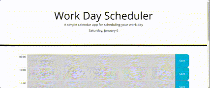

# Work Day Scheduler

## ## Project status
Development for this project is on pause, for now.

## Description
A challenge for myself to build a simple event scheduler by using the skills I have learned in jQuery and Day.js where possible. The page showcases a range of skills I have acquired so far, including retrieving todays date, targetting html elements and local storage getting and setting. It makes use of embedded arrays for data retrieval and manipulation. The design of the page is very basic, but functionality has been prioritised in order to start with a good base app in which a variety of styles can be played around with. The page allows for users to input events into their schedule and upon saving them, they are stored even when the browser has been refreshed. On top of jQuery and Day.js, the application also demonstrates an understanding of CSS, html, bootstrap and vanilla javaScript. 

https://rowankinross.github.io/rkinross-work-day-scheduler/

## Visuals
The following animation shows the appearance, usage and user interface of the application:

## Installation
n/a

## Usage
The title shows the name of the page. This is followed with a short description of the application and today's date, in format 'day, month and today's date' e.g 'Saturday, January 6'. Time blocks are displayed beneath with boxes in which text can be stored for a user's events. By clicking this box and typing, the user can add their event to the page temporarily. By clicking the 'save' button, the user can add the event to local storage, where it will be retrieved from when the page is refreshed. If nothing is added to the text box, the placeholder text will remain. The time blocks are colour coded to signify if the hour has passed, if it is the current hour, or if the hour is in the future. These colours only change once the current time changes hour, if the page is refreshed. Finally at the bottom of the page is a 'clear entire schedule' button to allow the user to start their schedule again from scratch. This clears the local storage and refreshes the page, therefore clearing the timeblocks of any event input.

## Contributing
As this is a personal project, designed to challenge and test my skills, I am not currently looking for contributors. However, there may be a opening for this in the future.

## Credits

edX challenge materials for setting the challenge and providing me with the skills to take on this project.

## License

MIT License - refer to LICENSE in the repo.